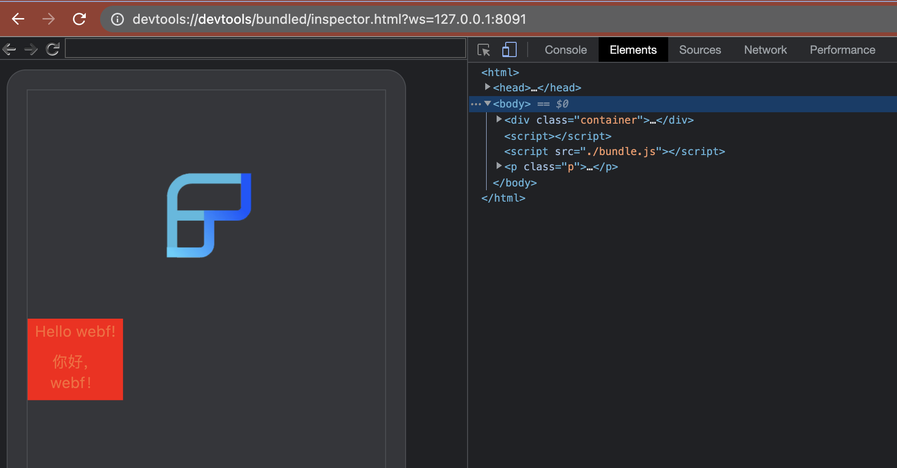

remote-devtool-proxy-example
---------------------

This demo's code demonstrates how to write a dev tool proxy that works with the WebF RemoteDevServerService. This allows you to let Chrome DevTools connect to your own service without worrying about the IP address of your WebF App.

It's dangerous to deploy a dev tool service without any Security check. 

Don't use this demo directly in real productions.

## How to use 

### 1. Start the server

```bash
node server
```

+ The WebSocket server for WebF Client will be listening at `ws://127.0.0.1:8090`.
+ The WebSocket server for Chrome DevTools will be listening at `ws://127.0.0.1:8091`.

### 2. On the WebF, Use `RemoteDevServerService` to connect to this server

```dart
WebF(
    devToolsService: RemoteDevServerService('ws://127.0.0.1:8090'),
    bundle: WebFBundle.fromUrl('assets:assets/bundle.html'),
)
```

### 3. Open your Chrome, and connect to the server

Use your chrome to open the following url.

```
devtools://devtools/bundled/inspector.html?ws=127.0.0.1:8091
```

### 4. Done

The DevTools works.


